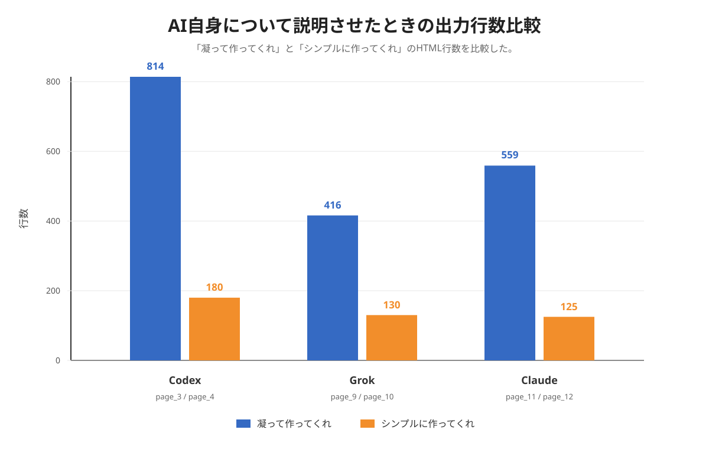

# AIが作成するWebページの好みと特徴の分析

## 1　研究の目的

近年、生成AIは文章を作るだけでなく、HTMLやCSSを使ってWebページを作ることもできるようになっている。自分で一からデザインを考えなくても、「高校についてページを作って」「AIについて紹介ページを作って」のように指示を出すだけで、ある程度完成したページが出力される。このことは便利である一方で、AIが作るページにはAIごとの「好み」や「くせ」があるのではないかと考えた。

生成AIを使った創作については、AIを使うことで一つ一つの作品の完成度が高く見える一方で、全体として似た作品が増える可能性があることが指摘されている（１）。また、AIが作ったデザインは、人間が作ったものと比べて「本物らしさ」や品質の感じ方に差が出る場合があることも報告されている（２）。さらに、AIに出す指示、つまりプロンプトについても、あいまいな指示より、目的や条件を具体的に書いた方が出力の質に関係しやすいとされている（３）（４）。これらの先行研究から、AIが作るWebページも、プロンプトの言葉や題材によって大きく変わる可能性があると考えた。

ここでいうAIの「好み」とは、意識や感情を指すのではなく、同じ種類の依頼に対して繰り返し現れる色・構成・言葉選びなどの出力上の傾向を便宜的に表したものである。出力の特徴と、筆者による解釈は区別して記述する。

この研究では、複数のAIや複数のプロンプトを使ってWebページを作成し、その結果を比較することで、AIがどのようなデザインや内容を選びやすいのかを調べる。特に、「凝って作ってくれ」と「シンプルに作ってくれ」という指示の違いによって、ページの構造や見た目がどのように変化するのかに注目した。また、「高校」というAIとあまり関係が深くない題材と、「あなたについて」というAI自身に関係が深い題材を比べることで、題材によってAIの出力に差が出るのかも調べた。

研究の目的は、AIのWebページ生成における傾向を明らかにし、人間が見て使いやすいと感じるページとのずれを考えることである。AIは命令に従っているように見えるが、実際には配色、余白、見出し、ボタン、アニメーションなどの選び方に一定の傾向がある。その傾向を知ることができれば、AIにWebページを作らせるときに、より適切な指示を出せるようになると考えた。特に、AI生成物に対する人間の評価では「よくできていること」と「人間らしく自然に感じること」が一致しない場合があるため（１）（２）、見た目の派手さだけでなく、情報の分かりやすさも含めて考える必要がある。

## 2　仮説

本研究では、次の三つの仮説を立てた。

第一に、「凝って作ってくれ」と指示した場合、AIは装飾やアニメーション、複雑なレイアウトを多く使うと考えた。反対に、「シンプルに作ってくれ」と指示した場合は、色数や装飾が少なくなり、見出し、本文、カード、フッターなどの基本的な構成に近づくと予想した。これは、プロンプトに含まれる条件や要求の書き方がAIの出力に影響するという先行研究（３）（４）から考えた仮説である。

第二に、AIと関連が深い題材では、AI自身の特徴やブランドイメージが強く反映されると考えた。たとえば、AIについて紹介するページでは、「知能」「会話」「推論」「未来感」などの言葉や、青、黒、紫、光るようなデザインが出やすいのではないかと予想した。一方、高校についてのページでは、学校案内に近い落ち着いたデザインになり、学習、探究、部活動、説明会など、実際の学校サイトによくありそうな内容が出ると考えた。生成AIの出力は便利で完成度が高く見えても、似た表現に寄る可能性があるため（１）、本研究でも題材の違いが出力の型に影響すると考えた。

第三に、AIの種類によって好みが違うと考えた。Codexはコード作成に関係するAIであるため、整ったHTMLやCSSを出しやすいと予想した。GrokはxAIに関連するAIであり、未来的で強い印象のデザインを作りやすいと考えた。Claudeは文章の丁寧さや安全性を重視する説明が多く、柔らかく落ち着いた雰囲気のページを作るのではないかと考えた。また、AIが作ったものに対する評価は、人間が作ったものに対する評価と同じではないという研究もあるため（２）、AIごとの特徴だけでなく、人間の好みとのずれも見られると予想した。

## 3　調査実験

調査では、AIに同じような条件のプロンプトを与え、出力されたHTMLファイルを比較した。実験は大きく二つに分けた。

実験Ⅰでは、Codexを使い、「高校について凝って作ってくれ」「高校についてシンプルに作ってくれ」「あなたについて凝って作ってくれ」「あなたについてシンプルに作ってくれ」という四つの条件でページを作成した。これにより、同じAIの中で、題材の違いと指示の違いがどのように表れるかを調べた。

実験Ⅱでは、「あなたについて」という題材にしぼり、複数のAIで「凝って作ってくれ」と「シンプルに作ってくれ」の出力を比較した。目次に記録された条件に従い、Codexのpage_5.html・page_6.html、Grokのpage_9.html・page_10.html、Claudeのpage_11.html・page_12.htmlを分析対象とした（１４）～（１９）。Codexのpage_5.htmlとpage_6.htmlは、実験Ⅰで同じプロンプトから作成したpage_3.htmlとpage_4.htmlとそれぞれ同じ内容である。同じプロンプトに対して同じページが出力された結果として分析に含める。

分析では画面上の印象とHTMLファイル内の構成・装飾の両方を参照した。行数はコード規模を大まかに把握する補助値であり、品質を直接示すものではない。改行やCSSの書き方によって同じ表示結果でも行数は変化しうる。また、表示幅を統一した計測、読み込み時間の計測、第三者評価は行っていないため、結果は保存されたファイルに対する記述的比較である。

比較の観点は、主に五つである。一つ目はページ全体の行数で、コードの量が多いほど、作り込みが多いと判断した。二つ目はレイアウトで、カード、グリッド、ヒーローセクション、ナビゲーションなどの構造を見た。三つ目は色や装飾で、グラデーション、影、光る表現、アニメーションの有無を確認した。四つ目は内容で、どのような説明や項目が選ばれているかを見た。五つ目は人間にとって見やすいかどうかで、情報が整理されているか、派手すぎないか、目的に合っているかを考えた。

実験で参照した主な資料は、README、目次となるindex.html、実験Ⅰのpage_1.htmlからpage_4.html、実験Ⅱのpage_5.html・page_6.htmlおよびpage_9.htmlからpage_12.htmlである。特にpage_1.htmlとpage_2.htmlは高校についての比較（１０）（１１）、page_3.htmlとpage_4.htmlはCodex自身についての比較（１２）（１３）、page_9.htmlとpage_10.htmlはGrokについての比較（１４）（１５）、page_11.htmlとpage_12.htmlはClaudeについての比較（１６）（１７）として用いた。

## 4　分析

まず、「凝って」と「シンプル」の違いは、コード量にかなりはっきり表れた。高校についてのページでは、凝った指定のpage_1.htmlは約1000行あり、シンプル指定のpage_2.htmlは約216行だった（１０）（１１）。Codexについてのページでも、凝った指定のpage_3.htmlは約814行、シンプル指定のpage_4.htmlは約180行だった（１２）（１３）。Grokではpage_9.htmlが約416行（１４）、page_10.htmlが約130行（１５）、Claudeではpage_11.htmlが約559行、page_12.htmlが約125行だった（１６）（１７）。この結果から、今回保存された出力では「凝って」という言葉が、装飾や構造を増やす方向に解釈されたと考えられる。凝ったページはシンプルなページのおよそ3.2～4.6倍の行数となったが、比較は四組に限られ、すべてのAIやプロンプトに一般化できない。行数は改行や記述方式にも左右されるため、多いほど良いデザインだとは言えない。

次に、題材の違いを見ると、高校についてのページでは、学校名、学校紹介、お知らせ、アクセス、説明会、部活動など、実際の高校の公式サイトにありそうな項目が出力されていた。シンプル指定では「みどり坂高等学校」という架空の学校名を使い、学校の特色として少人数の学習支援、探究活動、学校生活を挙げていた。これは人間が高校サイトを作るときにも自然に考えそうな内容であり、AIは一般的な高校サイトの型をかなり強く参照していると考えられる。ただし、実際の高校サイトを多数集めて比較したわけではないため、「一般的な型」という評価は筆者の観察に基づく。今後は、複数の現実の学校サイトから掲載項目を整理し、AIの出力に含まれる項目と照らし合わせれば、どの程度既存の慣習を反映しているかを具体的に確認できる。比較対象を増やせば、特定の一つの出力に見られた特徴と、題材に共通する特徴を分けて考えやすくなる。今回の観察は因果関係を証明するものではなく、次の調査で検証する仮説を得た段階として位置づける。

一方、CodexやGrok、Claudeについてのページでは、それぞれのAIの特徴を前面に出していた。Codexのページでは、コード作成、レビュー、デバッグ、既存コードの理解など、開発支援に関係する内容が多かった。実験Ⅱのpage_5.htmlとpage_6.htmlでも、凝った指定のページは開発手順やコード例を含む構成、シンプル指定のページは概要・できること・使い方を順に示す構成となっており、同じプロンプトで作成した実験Ⅰのページと同じ出力である（１２）（１３）（１８）（１９）。Grokのページでは、黒を基調にした背景、シアンや紫のグラデーション、ネオン風の文字、宇宙や真実追求といった言葉が使われていた。Claudeのページでは、安全、誠実、丁寧、正直といった言葉が目立ち、配色もテラコッタ系や落ち着いた色が使われていた。つまり、AI自身に関係が深い題材では、各AIのブランドや性格づけがデザインと文章の両方に表れた。黒・シアン・紫や宇宙に関する語が含まれることは観察できるが、それがモデル固有の好みなのか、一般的なAI紹介の表現なのかは、この実験だけでは判定できない。生成AIが個々の創作を助ける一方、集団全体の表現を似せる可能性を示した研究（１）を踏まえれば、よく見られる「未来的なAI像」が再生産されたという説明も考えられる。ただし、本研究のページ数だけでその仕組みを実証したものではない。

出力を比べるときには、文章の内容と視覚表現が互いに支え合っているかも重要である。たとえば、学校紹介ページでは安心感を伝える文章に対して、強い点滅や過度な動きがあると、印象が一致しない可能性がある。AI紹介ページで未来的な色を使うこと自体は題材に合う場合もあるが、その演出が本文の理解を助けているかは別に考える必要がある。今回の分析では、こうした一致や不一致を定量化できていないため、次回は「内容との一貫性」を独立した評価項目として追加したい。

「凝って」指定のページには、共通していくつかの特徴があった。まず、ヒーローセクションが大きく、最初の画面で強い印象を与えようとしていた。また、グラデーション、影、ぼかし、固定ナビゲーション、カード型レイアウト、アニメーションなどが多く使われた。たとえばGrokの凝ったページでは、ネオンのような文字、走査線のような表現、浮遊するカード、アイコンなどが使われており、AIが「凝ったデザイン」を「未来的で動きのあるデザイン」として解釈していることが分かる。

しかし、人間にとって見やすいかという点では、必ずしも凝ったページが優れているとは言えない。凝ったページは見た目の印象が強く、完成度が高く見える一方で、情報量や装飾が多いため、何を読めばよいのか迷いやすい場合がある。特にGrokのページでは、ページ全体の演出が強く、Webサイトとしては目立つが、紹介文を落ち着いて読むには少し派手だと感じた。高校のページでも、凝った指定では学校らしい安心感よりも、デザインの豪華さが先に目に入る部分があった。

反対に、「シンプル」指定のページは、行数が少なく、構成も分かりやすかった。見出し、本文、カード、リスト、フッターが順番に並び、どこに何が書かれているかが理解しやすい。人間が情報を探すという目的では、シンプルなページの方が向いている場合も多いと考えられる。ただし、シンプルなページは無難になりやすく、他のサイトとの差別化はしにくい。つまり、凝ったページは印象を作る力があり、シンプルなページは情報を伝える力があると言える。これはどちらかの優劣ではなく目的による。学校説明会の情報を探すページでは、利用者が迷わず日時やアクセスを見つけることが重要であり、イベント紹介では視覚的な個性が役立つ場合もある。使いやすさの原則（５）に照らして、情報の位置や明確さも評価する必要がある。さらに、コントラストやキーボード操作、動きを止める手段、画像の代替テキストなど、見た目の印象から分かりにくいアクセシビリティの確認も必要となる（６）。

また、生成AIが出力を作る過程は利用者から見えにくく、完成されたページだけを見ると、どの部分が指示に従ったものか、どの部分がモデルの定型的な提案なのかを区別しづらい。今回の実験では、短い指示に対してAIが自動的に補った要素も多いと考えられる。プロンプトを具体化し、必要な項目や避けたい演出を明示すると、利用者が意図した範囲に出力を近づけやすいという考え方がある（3）。一方で、AIの出力が指示の要件を満たしたかを利用者自身が評価し、必要に応じて修正する支援も重要である（4）。

AIごとの違いも見られた。Codexは、学校サイトやAI紹介サイトとして必要な要素を整えて出す傾向があった。見出し、ナビゲーション、カード、ボタンなどがきちんと配置されており、Webページの基本構造を重視しているように見えた。Grokは、最も個性が強く、黒い背景やネオンカラー、宇宙や真実といった言葉を使い、エンタメ性のあるページを作っていた。Claudeは、文章が丁寧で、自己紹介、できること、大切にしていることを順番に説明していた。凝ったページでも、Grokほど派手ではなく、雰囲気や読みやすさを大切にしているように感じた。

以上から、AIの出力はプロンプトに大きく左右されるが、それだけではなく、題材やAIの種類によっても変わることが分かった。AIは人間の好みに合わせているように見えるが、実際には「凝って」と言われると装飾を増やしすぎたり、「AIについて」と言われると未来的・抽象的なイメージに寄りやすかったりする。この点が、人間の好みとずれる部分だと考えられる。

## 5　成果と課題

本研究の成果は、AIが作るWebページの傾向を、実際の出力ファイルをもとに比較できたことである。特に、「凝って」と「シンプル」という短い言葉の違いだけでも、コード量、配色、レイアウト、内容の深さが大きく変わることが分かった。また、AIと関係が薄い題材では一般的な型に近いページが出やすく、AI自身に関係が深い題材では、各AIの特徴やブランドイメージが強く出ることも確認できた。

この結果から、AIにWebページを作らせるときは、「凝って」「シンプル」だけでなく、「誰が見るページなのか」「何を一番伝えたいのか」「派手さより読みやすさを優先するのか」などを具体的に指定する必要があると考えた。たとえば高校のページなら、「保護者と中学生が見やすいように」「学校説明会の情報を目立たせて」「色は落ち着いた緑系で」などと伝える方が、人間の目的に合うページになりやすい。

プロンプトには、ページの目的、対象者、情報の優先順位、望ましい雰囲気、避けたい表現、スマートフォンでの見え方などを含めると、要件を伝えやすくなる。要求を整理してから指示にする方法は、要件を明確にするプロンプト研究とも関係する（３）。ただし、条件を増やせば必ず理想の出力になるわけではなく、生成されたHTMLの内容や動作を人間が確認する必要がある。

一方で、課題もある。AIごとの違いに関する比較は、Codex、Grok、Claudeの三種類に限られている。また、評価方法も主に自分の目で見た印象に基づいているため、客観性が足りない。今後は、複数人にページを見てもらい、「見やすさ」「信頼感」「かっこよさ」「情報の探しやすさ」などを点数で評価してもらうと、より正確な分析ができると考える。

次の実験では、同じプロンプトを各AIに複数回入力し、モデル名、利用日、入力全文、出力ファイルを保存すると再現性が高まる。実験条件をそろえるため、題材と指示文をあらかじめ固定し、各AIに同じ環境幅やページ数の条件を与える。『凝って』『シンプル』以外に、目的・対象者・装飾の量だけを一つずつ変える条件も設ければ、どの要素が出力の違いと関係するのかをより整理して見られる。各条件で複数回生成し、偶然の揺れと繰り返し現れる傾向を区別することも必要である。評価者にはAI名を知らせずに複数ページを見てもらい、見やすさ、信頼感、情報の探しやすさ、スマートフォン操作などを分けて評価してもらう方法も考えられる。さらに、HTMLの見出し構造、リンクやボタンの動作、画像の代替テキストなどを公開基準（６）に沿って確認できる。生成AIで構築されたウェブサイトのアクセシビリティを調べた研究でも、生成後の確認が重要な論点となっている（７）。

さらに、プロンプトの言葉をもっと細かく変える実験も必要である。今回は「凝って」と「シンプル」を比較したが、「高校生向けに」「保護者向けに」「公式サイトらしく」「文化祭のサイトらしく」など、目的や対象を変えると結果も変わるはずである。AIの好みを知るだけでなく、人間がAIにどのように指示すればよいのかを調べることが、今後の重要な課題である。

以上を踏まえると、今回の研究から得られる実用的な示唆は、生成AIを完成品の自動作成者と見るより、複数の初期案を作り、比較・修正するための支援者として扱うことである。初めに目的や対象者、必要な情報を整理し、AIに案を作らせ、その後に人間が内容の正確さ、読みやすさ、操作性を確かめる。こうした手順なら、AIの得意な短時間の案出しを活用しつつ、利用者に合った仕上がりかどうかを人間が判断できる。

本研究の結論は、AIの種類だけでページの違いを説明することは難しく、指示の具体性、題材、保存された出力の条件も併せて考える必要があるということである。『凝って』という指示では行数や装飾が増え、『シンプル』では基本構成が中心となる傾向が観察された。また、AI自身を題材にすると、それぞれの紹介文や色づかいに違いが現れた。一方で、今回のデータは少数で、印象評価も筆者一人に限られるため、傾向を確かめるためには反復実験と利用者評価が必要である。

今回の研究を通して、AIはとても便利な道具だが、出力をそのまま使えばよいわけではないと分かった。生成された文章には架空の情報や、実際のサービス内容と一致しない説明が含まれることも考えられるため、事実確認も必要である。また、ページの見た目が整っていても、リンク切れやスマートフォンでの表示崩れが残る可能性がある。利用者に公開する前に、人間が情報、表示、操作を確認し、必要な修正を加えることが大切である。AIの出力を批判的に確認する姿勢を保ちながら、その案出しの速さを活かすことが、より良いWebページ作成につながると考える。AIは短時間で多くの案を作ることができる。しかし、最終的にそのページが本当に使いやすいか、目的に合っているかを判断するのは人間である。AIの好みやくせを理解しながら使うことで、人間とAIが協力してより良いWebページを作れるようになると考える。

## 6　参考文献・引用文献

1. Anil R. Doshi, Oliver P. Hauser「Generative AI enhances individual creativity but reduces the collective diversity of novel content」Science Advances, 10(28), 2024. https://doi.org/10.1126/sciadv.adn5290

2. Garim Lee, Hye-Young Kim「Human vs. AI: The battle for authenticity in fashion design and consumer response」Journal of Retailing and Consumer Services, 2024. https://doi.org/10.1016/j.jretconser.2023.103690

3. Qianou Ma, Weirui Peng, Chenyang Yang, Hua Shen, Ken Koedinger「What Should We Engineer in Prompts? Training Humans in Requirement-Driven LLM Use」ACM Transactions on Computer-Human Interaction, 2025. https://doi.org/10.1145/3731756

4. Tae Soo Kim, Yoonjoo Lee, Jamin Shin, Young-Ho Kim, Juho Kim「EvalLM: Interactive Evaluation of Large Language Model Prompts on User-Defined Criteria」CHI Conference on Human Factors in Computing Systems, 2024. https://doi.org/10.1145/3613904.3642216

5. Jakob Nielsen「10 Usability Heuristics for User Interface Design」Nielsen Norman Group. https://www.nngroup.com/articles/ten-usability-heuristics/

6. World Wide Web Consortium (W3C)「Web Content Accessibility Guidelines (WCAG) 2.2」W3C Recommendation, 2024. https://www.w3.org/TR/WCAG22/

7. Zsuzsanna B. Palmer, Sushil K. Oswal「Constructing Websites with Generative AI Tools: The Accessibility of Their Workflows and Products for Users With Disabilities」Technical Communication, 2025. https://doi.org/10.1177/10506519241280644

8. `readme.md`「グロタンの探求」研究メモ。

9. `index.html` 実験ページの目次およびプロンプト一覧。

10. `page_1.html` Codex使用「高校について凝って作ってくれ」の出力。

11. `page_2.html` Codex使用「高校についてシンプルに作ってくれ」の出力。

12. `page_3.html` Codex使用「あなたについて凝って作ってくれ」の出力。

13. `page_4.html` Codex使用「あなたについてシンプルに作ってくれ」の出力。

14. `page_9.html` Grok使用「あなたについて凝って作ってくれ」の出力。

15. `page_10.html` Grok使用「あなたについてシンプルに作ってくれ」の出力。

16. `page_11.html` Claude使用「あなたについて凝って作ってくれ」の出力。

17. `page_12.html` Claude使用「あなたについてシンプルに作ってくれ」の出力。

18. `page_5.html` 実験Ⅱ・Codex使用「あなたについて凝って作ってくれ」の出力。

19. `page_6.html` 実験Ⅱ・Codex使用「あなたについてシンプルに作ってくれ」の出力。
